# networkwalks-b083-wk2-penetration-testing-report
## FOOTPRINTING & NETWORK SCANNING PHASES
W2-PM-FINAL | CYBERSECURITY |  NETWORKWALKS
* Pentester Name (Cybersecurity Professional): Iffrah Nauman
* Program/Batch: B083-Networkwalks
* Date: 16 september 2026
* Modules completed: W2-PM1 (Mutiple Kali Tools) W2-PM3 (Maltego) W2-PM5 (Zenmap scanning)
* Client/Target: Networkwalks (secured permission already) | My own local LAN network
* Permission secured from client: Yes
* Phases covered: Phase 1: Reconnaissance and Footprinting
                  Phase 2: Scanning and network discovery
                  Phase 3-5: In progress
  ## 1. Liability disclaimer
  I have performed these activities only on the systems & devices where I had secured written permission or the devices/systems that I own myself. All these materials are for education and research purpose only. Do not use anything from here to break the law. The instructor, the authors and Networkwalks are not responsible for what you do with this knowledge. Every action you take is your own responsibility. Misuse can lead to criminal charges, heavy fines, loss of your job and a permanent record. In most countries unauthorised access is a crime even when nothing is damaged.
  ## 2. Introduction
  This report covers footprinting the networkwalks.com domain using multiple Kali Linux tools (W2-PM1) , W2-PM3 (Maltego) and scanning my own local network with Zenmap (W2-PM5). One module covers the footprinting phase and the other covers the scanning phase, so together they show how an attacker moves from gathering public information to mapping live hosts on a network. It is the Week 2 part of my ongoing internship program at Networkwalks.
All commands were run in Kali Linux (footprinting) , maltego and on a Windows PC with Zenmap installed (scanning). Every step below includes the exact command used, the result I observed, a screenshot as evidence, and a short note on why the finding matters from an attacker's point of view.
## 3. Tools used
below are the list of tools used and their purpose
* Kali Linux & Windows : Operating system used for reconnaissance activity
* WHOIS: find domain registration details(owner , dates , names , server)
* whatweb: web technologies used (IP , server )
* nslookup: resolve domain name to its IP
* curl -l: tells HTTP response headers
* wafw00f: tells whether there is firewall protecting the site
* dnsrecon: all DNS records
* Maltego: tool used for OSINT and reconnaissance.( tells which information is connected which person , domain , company etc)
* Zenmap(Nmap GUI): scans the local subnet to find live hosts , IPs and MAC addresses
* Windows CMD: local IP and MAC address identification
## 4. Activities Performed
### 4.1 Footprinting and Reconnaissance
I performed reconnaissance/footprinting against networkwalks to find information about target. I used six kali tools to collect information. firstly , i used WHOIS which give us all publicaly available information about domain name , registrar , domain ID , domain server etc. The second tool i used was whatweb which gives information about web technologies used like IP address , server , email , HTTP server and WordPress 7.0.4 and WP download manager. after that i used nslookup which resolves the domain name to it's IP address. it resolved networkwalks.com into 192.232.216.135. the fourth tool i used was curl -l  which provides us with all information about HTTP response headers , wordpress , type:applicaton/json , path. the 5th tool i used was wafw00f it tells us whether a firewall is protecting a site or not. we get the result that the site is behind modsecurity. the last kali tool i used is dnsrecon it tells us about all dns records (TXT , NS ) related to mail records.
I also performed reconnaissance with maltego which is an OSINT tool it tells us which information is related to which person , compamy etc). I used the Transform → Utilities → To Email Address option to investigate email-related information. The transform used the information already available in the graph to identify related email information and display the relationships between the entities.
## 4.2 Network Scanning with Zenmap
For the second phase to perform scanning against networkwalks , I used Zenmap. This tool is used to scan IP addresses to find all live hosts , generate network topology. first I found my device's local IP address my running ipconfig command in cmd which in return gave my device IP address.Then by ping scanning my IP i was resulted with live hosts , MAC addresses and device's name that is connected. this way, i  identified live hosts and also saved network topology in pdf format as required in task. Below is the list of live host's IP addresses i found through ping scanning. I found 7 live hosts (including my own device).
* 192.168.0.110
* 192.168.0.1
* 192.168.0.148
* 192.168.0.165
* 192.168.0.177
* 192.168.0.180
* 192.168.0.195
## Risk analysis and impact
based on the information collected during footprinting and network scanning activities i identified the following risks:
### Risk/finding | Evidence/Observation | Potential Impact | Risk Level
* 1. web information exposed | WordPress(7.1) , JSON , WP download manager |attackers can use this information and version to identify software| medium
  2. IP address information| Nslookup resolved domain name to IP address 192.232.216.135| this revealed information about network address|low
  3. revelead HTTP information| curl revealed HTTP response headers| May help attackers to find more clues | low
  4.  WAF technology| wafw00f identified modsecurity| reveals information that whether a site is protected by firewall and can help attackers to know about security architecture | low
  5.  DNS information identification| DNSRecon identified DNS , mail , records | DNS information can help build broader profile| medium
  6.  contact and domain information exposure| maltego , tranform rule revealed the emails-related information| may reveal sensitive information like mails , domains | medium
  7.  Live hosts visibility| Zenmap identified multiple live hosts and IP addresses in network|unauthorized devices present on network|medium.
* The risks above are information collected from footprinting and scanning exercises however they are not confirmed vulnerabilities and not potentially lead to attack.
## Recomendations
based on above observations i reccomend following improvements:
* organizations should review their publicaly available information.
* keep software and applications updated.
* Review HTTP headers to see if only required information is available.
* properly configure firewall for additional security
* investigate whether your network is connected to only authorized devices.
* perform regular testing.
* maintain proper documentation.
## Conclusions:
During week 2 , of my cybersecurity ethical hacking internship i worked mainly on its 2 phases: footprinting and scanning. First i understood what reconnaissance/footprinting means , what are the methods to collect data. I used 6 kali tools of task (W2-PM1) to gather all publically available data which provides much information about target's IP , domain , HTTP information. i used WHOIS , Whatweb , Nslookup , curl -I , wafw00f , dnsrecon. Then after collecting all the information from these kali tools. I used additional task(W2-PM3) tool. first i downloaded maltego and then used  Maltego to collect to reveal sensitive information like mails. Then in scanning phase i used (nmap GUI) zenmap. before scanning with nmap i identified my device's local IP by writing ipconfig in cmd which give me IP address 192.168.0.110 and ping scanning this IP i got to know live hosts.
through this i got to know that information gathering is important part of cybersecurity. when gathering information we dont only get to know the type of information but also how to make use of that information to extract related information that is useful. A good cybersecurity professional documents every step and that's what it made me realize that how important documenting is. we can track changes and see what we did step by step. Finally, I learned that reconnaissance and scanning must always be performed within an authorized scope. These activities were completed as part of the assigned educational cybersecurity lab.
## Evidence Collected
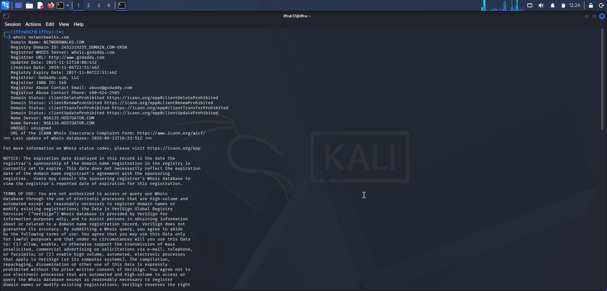
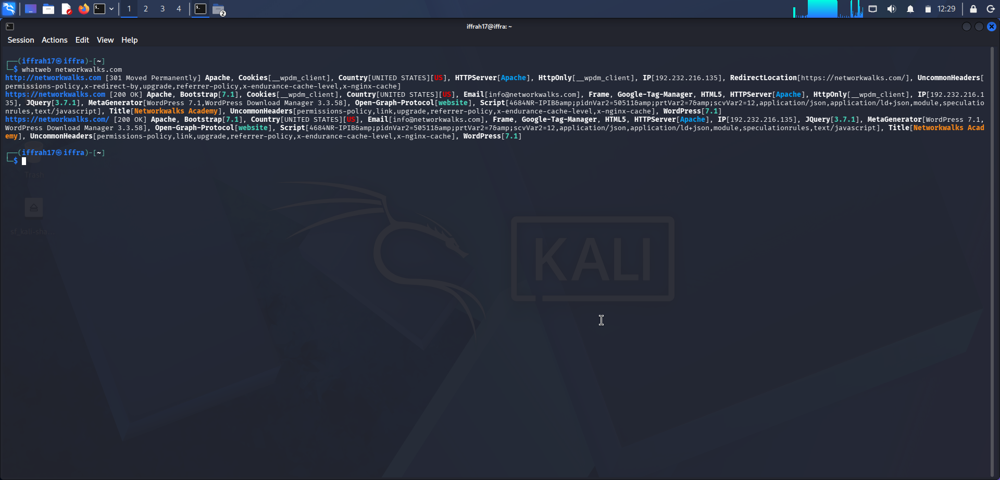
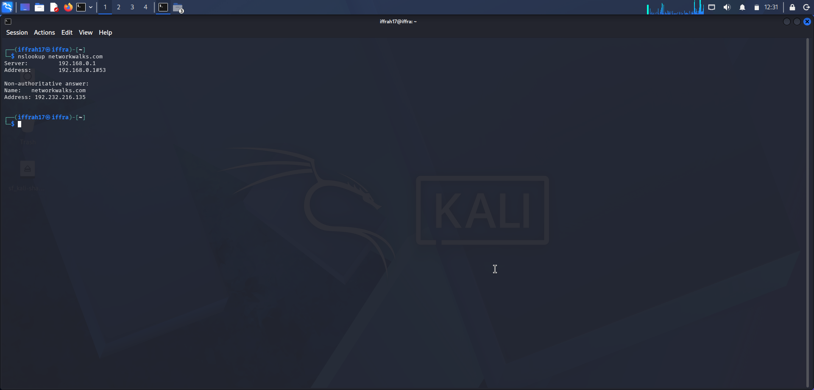
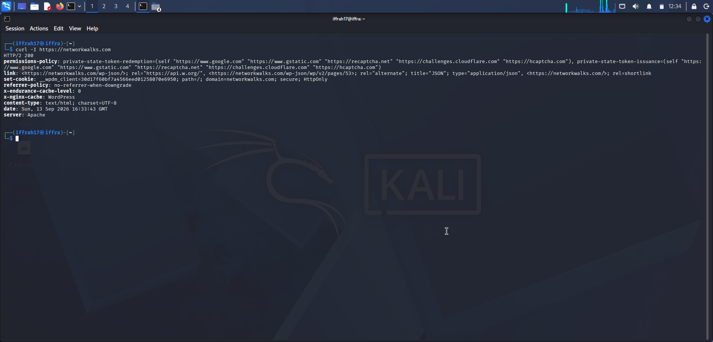
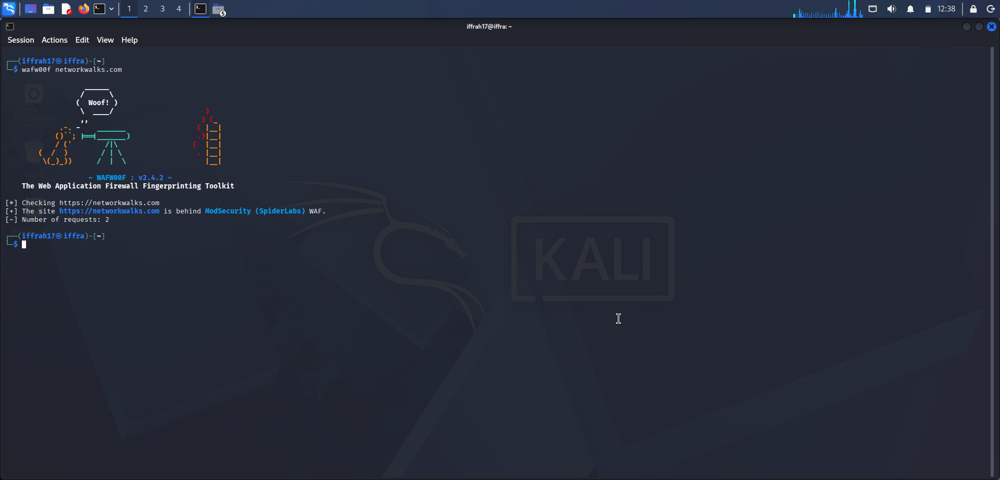
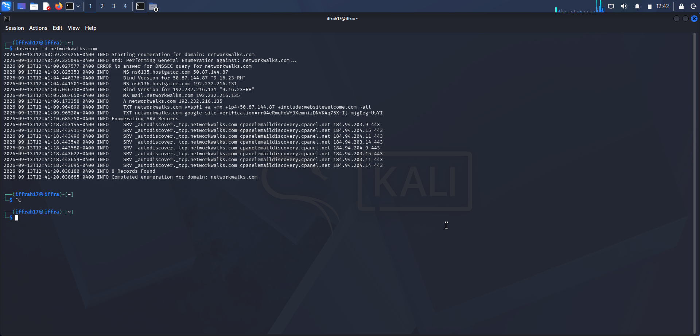
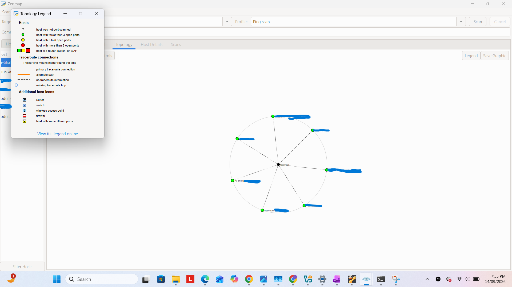
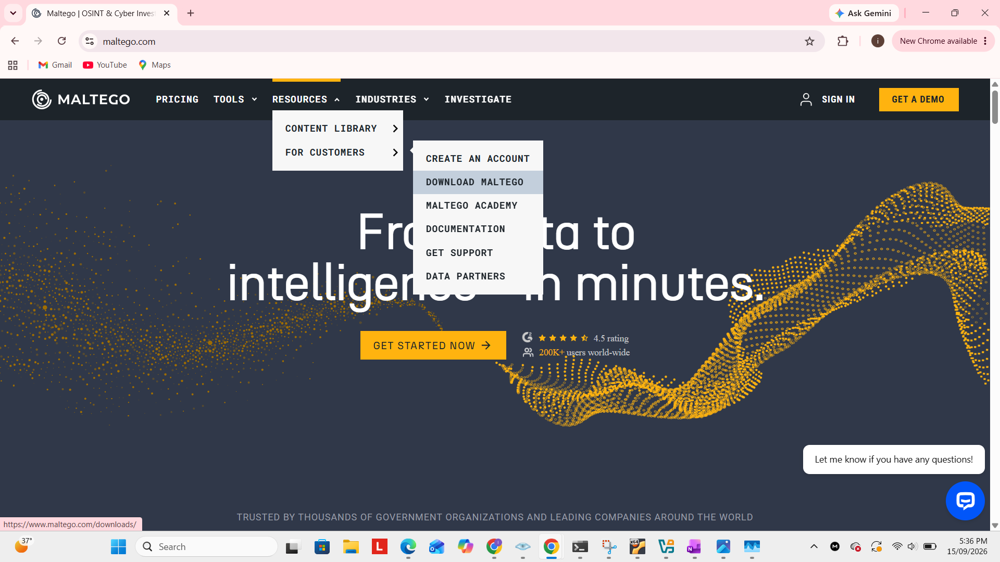
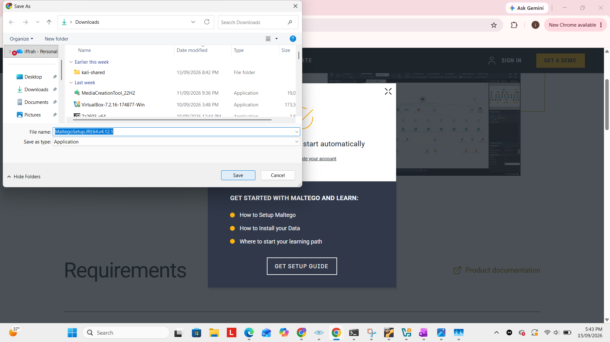
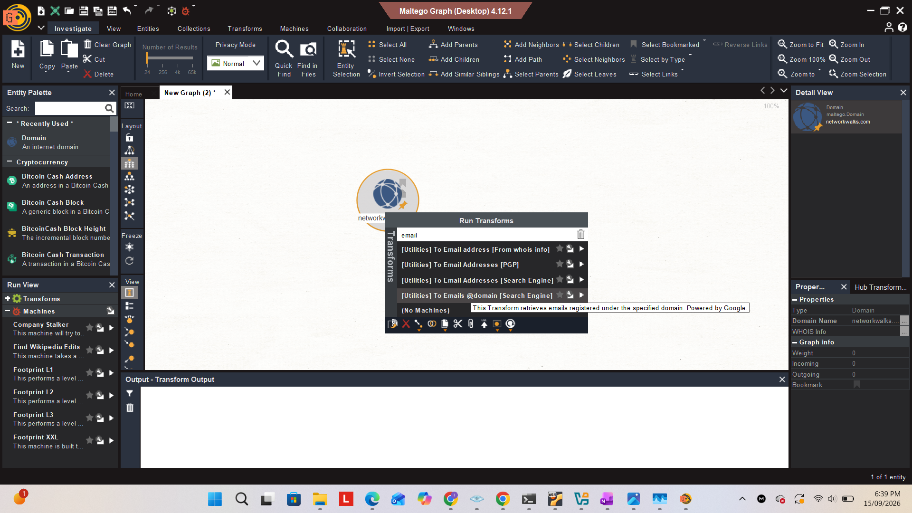
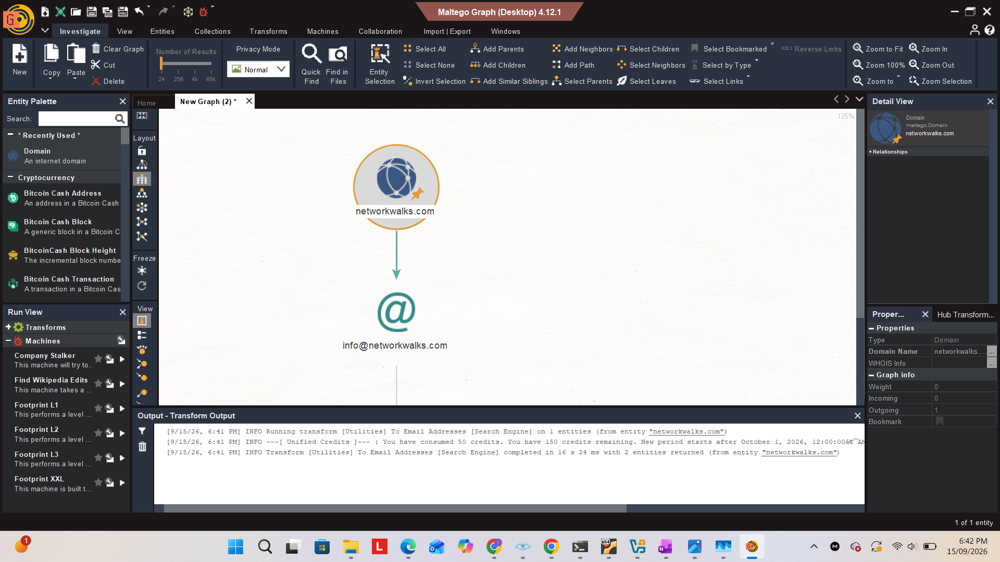

### Author: Iffrah Nauman
* cybersecurity professional B083
* Linkedin:
  ### Project Information
  #### Program Name:  Cybersecurity program at Networkwalks | Week: 02 | Repository: GitHub

